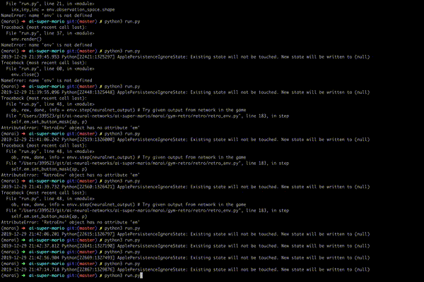
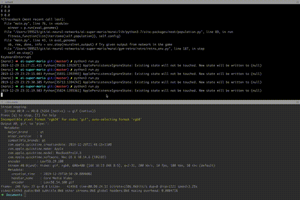
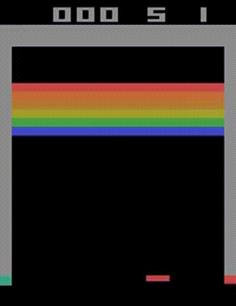

# ai-neural-networks
Artificial intelligence | Machine learning | Neural Networks

Repository consists of various AI / Machine learning projects that I've worked on. 
## Super mario AI using NEAT (NeuroEvolution of Augmenting Topologies)
The AI / network was trained for around 6+ hours (equating to more than 4000+ games seen & played by the AI) and was able to complete the level by the end of 93rd generation. 

NEAT algorithm(http://nn.cs.utexas.edu/downloads/papers/stanley.cec02.pdf) was used to train mario AI in this particular case; with only information to the network being the inputs (flatted 1D image of the frame) and output (representing the button presses). The network slowly learned across multiple generations on achieving maximum fitness, which is also a parameter fed back into the network for every generation to help the network see the strongest/traits of species from every generation and propogate this to the next generation.

**Further work**: This solution seemed to converge quickly (well, relatively!) when population size was increased (to 150+) for some reason(that I'm still studying). For lower population sizes (20 or 30), the species seemed to stagnate across generations without any progress (despite running for days).

Here's the 93rd generation finishing the game:

Here's the same trained neural network playing Level-2 for the first time. (not perfect, but impressive how it's evolved)

## Deep Q learning on atari games (model trained on GCP VMs with GPU accelerators - Nvidia K80, P100)

Deep-Q neural network was used to train atari's breakout. Training was done on GCP VMs to leverage GPU processing - Nvidia k80 and p100 were used. 

